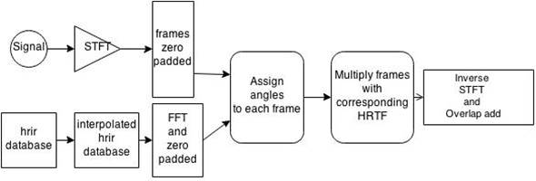
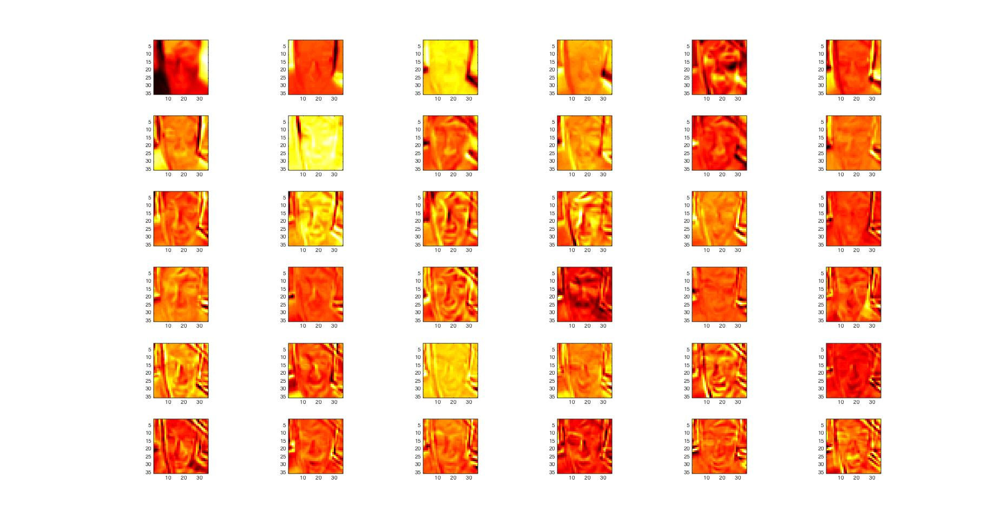
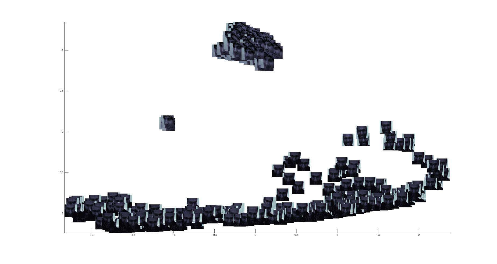
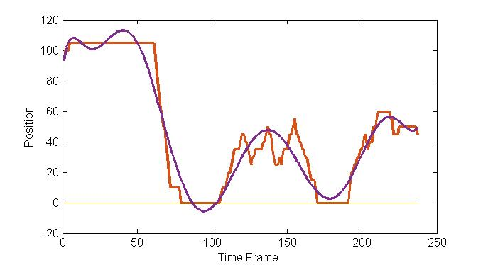
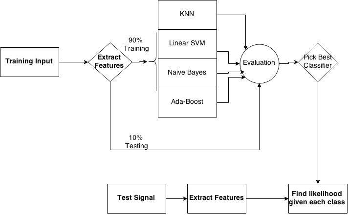

Introduction {#sec:intro}
============

Spatial audio and speaker classifications, both have important
applications in video conferencing and entertainment. With spatial
audio, one can listen to music and feel the depth and the directionality
of the sound using headphones or crosstalk canceller speakers [1].
Imagine hearing a tank approaching you from the living room when playing
high-end resolution video games. 3D audio is yet to be able achieve
these ambitious goals, though it can still create a more realistic sound
fields than surround sound. 3D audio is normally recorded through
binaural microphones mounted on a Kemar [2]. One can also reconstruct 3D
audio using Head Related Transfer Function by forming beams at every
direction using microphone arrays [3]. These techniques require precise
calibration and are not very accurate in real environments due to noise
and reverberation. Most importantly, if a video was not recorded using
microphone arrays or binaural microphones, it is too difficult, if not
impossible, to recover spatial audio. That is why we purpose a method by
using the contents in the video, the visual cues, to help reconstructing
3D audio.
The other goal of this project is to perform multimodal speaker
recognition using facial and speech likelihoods by first learning
different features from a training video using a user friendly
calibration procedure discussed in this paper. In section II, we talk
about the general flow of the algorithm for reconstructing 3D audio and
speaker recognition algorithms. In section III, face detection,
classification, and tracking are discussed in details. In section IV,
voice activity detection (VAD) and speech classification algorithms are
explained thoroughly. In section V, we go over the results for 3D audio
reconstruction and multimodal speaker recognition. And finally, in
section VI, we suggest future possibilities for our project in other
systems and applications.

General Flow {#ssec:subhead}
============

In this section, the basic procedure for reconstructing 3D audio and
multimodal speaker recognition are discussed.

3D Audio Reconstruction
-----------------------

One can reconstruct a 3D audio by simply convolving a mono sound with
the spatial response corresponding to a desired location in space. These
impulse responses can be captured by recording a maximum length sequence
(MLS) at listener’s ears at different angles. We can then extract
corresponding impulse responses by cross-correlating the recorded MLS
with the original MLS as shown in equation 1. These spatial responses
are also called head Related Impulse Response (hrir).

$$\begin{subequations}
\begin{gathered}
index = argmax({C_{(MLS_{recorded},MLS_{original})}})\\
hrir = C_{(MLS_{recorded},MLS_{original})}(index-L:index+L)\\
3D_{audio} = signal_{mono} * hrir
\end{gathered}
\end{subequations}$$

Where $L$ is half the impulse response desired length. This number is
usually about 128 samples, but it can differ based on the recording
room, e.g. such the early reflection sample index and $C_{xy}$
represents the cross-correlation between $x$ and $y$. In this project we
used MIT HRTF database for reconstructing spatial audio [4].

In order to avoid clicking sounds when reconstructing 3D audio and also
for simplicity, we did the reconstruction in frequency domain. In short,
one must first find the short time Fourier transform of the signal and
then multiplied that by the desired zero-padded HRTF and take inverse
STFT to recover the time domain signal back, as shown in figure 1.

We made a few assumptions to make this project doable in our limited
timeline.

1. This algorithm is only able to spatialize speech based on a
speaker’s face.
2. There are at most two speakers in the video.
3. At least one of the two speakers in the room is in the training
database.
4. There are no sudden movements in the video stream.

Most of this assumption can be relaxed even further, some which are
discussed in section VI. For simplicity, we used the following video
clip for testing our applications.
We recorded a video clip of two people sitting on left and right of a
video frame having a conversation, as shown in figure 2. We also purpose
a calibration procedure that require some user interference for training
facial and speech database from each user.

## Calibration ##

The calibration procedure is as follows,

Each user is asked to,

1. Clap hands and wave to the camera.
2. Speak for about a minutes while facing the camera.

This calibration procedure is repeated until another clap sound is
detected, which means there is another user whose database needs to be
collected as well. This calibration procedure helps us particularly in
labeling the training database. This is summarized in figure 3.

\begin{figure}[htb]
\center{\includegraphics[width=4.0cm]{calibration.jpg}}
\label{fig:res}
\caption{Calibration}
\end{figure}

After collecting a training database, we proceed making classifier which
is discussed in more details in section III and IV.
The procedure for reconstructing a 3D audio is as follows,

## 3D Audio Reconstruction ##

1. Detect faces in the video stream for each frame and classify them to
one in the database.
2. Map the position of each face to a meaningful HRTF angle in each
frame.
3. Detect whether there is speech in a frame or not.
4. Label the frames with speech from step 4 with their corresponding
class label in the database.
5. Use speech classification results to assign the speech from step 4 to
the point find from step 2. That is, given a speech signal, find
corresponding face location.
6. Pick corresponding HRTFs from step 5 for each frame.
7. Reconstruct 3D audio as shown in figure 1.

Speaker Recognition
-------------------

Consider the same video from section 2.1. We would like to be able to
identify each user using their facial and speech features. If the
speaker is not talking, then the recognition system should put more
weight towards the facial classifier. If the speaker’s face cannot be
detected, then the classification algorithm only uses the speech
classifier. If both face and speech are available, then the
classification algorithm will use both with some weighting on each model
to determine and identify each user for maximizing the user recognition
likelihood given the training database.

$$\begin{aligned}
P(user) = P(face|model)^{W_i}P(face \ model)+...\\P(speech|model)^{W_{max}-W_i}P(speech \ model)
\ \ \ \ \ \ \ \ \ \ \ \ \ (2)\end{aligned}$$

The prior probabilities in equation 2 are assumed to be equally
probable, however, in practice for better accuracy they need to be
estimated more carefully given the environment and the recording
equipment.
Steps 1 through 4 in *3D Audio Reconstruction* are also
performed when doing speaker recognition. After having a training
database for faces and speech, we then do the following,

## Multimodal Speaker Recognition ##

1. Find the likelihood of each user’s face given the face model in each
frame analysis.
2. Find the likelihood of each user’s speech given the speech model in
each frame analysis.
3. Plug the values from step 5 and 6 in equation 2.
4. Determine the value of equation 2 for $w=1, 2..., 10$.
5. Find $w$ such that, $argmax_w(P(user))$.

Higher $w$’s shows that the face classification results was better than
speech classification results, and so we should put more weight on the
facial classifier. This could be due to the quality of the training set,
or just the fact that the face classifier works better than the speech
classifier. As an example, one way of choosing $w$ is measure the SNR of
the signal, and put more weight on the speech classifier when the SNR is
higher. With figure 4 summarizing the general flow of this project, we
conclude section II.

FACE DETECTION, CLASSIFICATION AND TRACKING
===========================================

In this section, we discuss the details of detecting faces in a video
stream, training facial features, and tracking faces throughout the
video frames.

Face Detection
--------------

The first step in detecting faces is preprocessing every frame. In most
image processing application, preprocessing is done to assure better
quality results. For this project the preprocessing steps are as
follows,

1. Resize the video frames to smaller dimensions so we can detect
faces faster.
2. Map the RGB color to gray colormap to simplify the computation.
3. Apply histogram equalization to each frame to make sure the contrast
is evenly spread out throughout the whole pixels.

We then setup Matlab’s vision library for face detection [5]. Since some
detected faces are going to be small, we defined a threshold that would
disregard any faces smaller than a certain number of pixels. This would
create a precise training database. We then resize and vectorised all
detected faces into a matrix for each user (face database). This is
summarized in figure 5.

\begin{figure}[htb]
\begin{minipage}[b]{0.88\linewidth}
\centering
\centerline{\includegraphics[width=3.0cm]{face_detection.jpg}}
\end{minipage}
\caption{Face Detection}
\label{fig:res}
\end{figure}

Note that if there is more than one user in the room, we need to be able
to identify the approximate location of each so we can label them. This
is why we defined the calibration procedure in section II. We first
attempted to find this location by detecting mouth movement, however,
due to resizing; the resolution was not high enough to detect lips
movement. For simplicity, we ask our users to clap and wave to the
camera, since it is easier to detect a bigger area of a motion. We
simply use frame subtraction to identify the pixels that corresponds to
higher variance. The clap sound detection from previous section will
tell us the approximate frame number for the clap motion in the video,
so the area of search is only a few frames.

$$\begin{gathered}
sub_{frame} = (frame_i - mean(frame_{1:i-1}))^2 \\ 
[i_{max}, j_{max}] = max(sub_{i=1:n,j=1:m})\end{gathered}$$

Where $n$ and $m$ are the number of pixels in the vertical and
horizontal axis. We don’t care for the exact position of those high
variant pixels, we only need an approximation of which part of the frame
that specific user is located at, e.g. left, right, up, down. The
resulting pictures for frame subtraction, division and face detection is
shown in figure 6.

\begin{figure}[htb]
\begin{minipage}[b]{0.88\linewidth}
\centerline{\includegraphics[width=5.60cm]{clap_motion.jpg}}
\centerline{\includegraphics[width=6.60cm]{3d_audio_tracking_1.jpg}}
\centerline{\includegraphics[width=3.0cm]{3d_audio_tracking_2.jpg}}
\end{minipage}
\caption{Frame subtraction and division into two partitions for labeling each class}
\label{fig:res}
\end{figure}

Face Classification
-------------------

Now that we have a database of faces for each user, we need to train
each database. We used Gaussian Mixture Models for training the facial
database. Since the dimensions of the training database are fairly
large, we first lower the dimensionality of the database using PCA to 36
and then use a 5 order GMM to fit it to the model. Dimensionality
reduction is also important when training a database with a GMM, since
in high dimensions; GMM might not able to estimate the covariance
matrix. Face training is summarized below.

$$\begin{gathered}
Train = \{train_{user1}, train_{user2}\} \\ 
Pt = PCA(train,number\ of\ eigenvector) \\ 
Gpt = GMM(pt,dimensions)\end{gathered}$$

The eigen faces from the PCA is shown in figure 7.

Having the GMM model for each database, one can then easily find the
probability of each face given each model by calculating the log
likelihood of the testing data that is projected to PCA space in
equation 2.b, given the mean and the variance find in equation 2.c. This
is shown in equation 3.

$$\begin{aligned}
f(test|\mu,\sigma) = \frac{1}{test\ \sigma\sqrt{w\pi}}e^\frac{ln(x-\mu)^2}{2\sigma^2}
\end{aligned}$$

In figure 8, the scatter plot each class using the first two highest
eigenvector from the PCA matrix is shown. As you can see the two classes
are linearly separable, so we should be able to get high accuracy from
our classifier.

We left $10\%$ of our training database for testing and trained the
remaining $90\%$. The result of our facial classifier is tabulated
below.

\begin{center}
\begin{tabular}{ | l|c | r| }
\hline
Class 1 & $95\%$ \\ \hline
Class 2 & $100\%$ \\ \hline
\end{tabular}
\end{center}
\centerline{Table 1: Face Classification Accuracy}

As expected we have high accuracies, since the two classes were shown to
be linearly separable in 2 dimensions.

Face Tracking
-------------

Matlab’s face detection function draw a rectangle around the detected
faces. We extracted the coordinates for that rectangle and use the
center of the rectangle as the position of the detected user. Such
tracking algorithm usually does give good results due to face detection
inaccuracy. Since we do not need to know the exact position of the user
at each frame, we can compensate for this flaw by applying moving
average to the tracking results as well as fitting a polynomial to it
(in this case a polynomial of order 10 and moving average of 25 frames
length). If the sources were stationary we can use a longer moving
average for smoothing the results. The result of such process is shown
in figure 9.

The $x-axis$ corresponds to the time frame, and the $y-axis$ is the
approximated $x-position$ of the detected face. We only look at things
in the azimuth, since the 3D audio does not sound very good for
elevation angles.

In general, for recreating sptial audio for $n$ people, we need at least
$n-1$ training databases. As discussed in section 2.1 we assumed that we
only have up to 2 users in a video frame. Therefore, if we have the
training dataset for one of the users, we can classify one in the
databse with a lable and define a threshold for the other user; so we
can label him/her as unknown class. This threshold is defined as
following,

$$\begin{aligned}
if \ P(face|model)<TH \\
then\ \ \ 
Face_{label} : unknown
\end{aligned}$$

The tracking result of having one unknown and one known user in a frame
video shown in figure 6 is shown in figure 10.

As you can see, each source is correctly detected at opposite edge of
each video frame. The spikes in these graphs are mainly for two reasons,
1- slight head movement and 2- Face detection errors. As mentioned
earlier, the first problem can be ease out by using moving average and
the second problem by fitting a polynomial to the database as seen in
figure 9. The spectrogram shown in figure 10 is also the tracking
results; we mainly use it since it is clearer when visualizing the
tracking over video frames.

VOICE ACTIVITY DETECTION AND CLASSIFICATION
===========================================

Voice Activity Detection
------------------------

In order to have a good speech recognition system, we remove the
non-speech components (silences) from the desired signal. This way the
only signal that we have in our training database is speech. As
mentioned earlier in section 2, the calibration procedure help labeling
the speech signals, so we already know the approximate time interval in
the signal for each user.

In order to do VAD, we developed a supervised method by training speech
and non-speech signals. We used log spectral coefficients (LSC) and Mel
frequency cepstral coefficients (MFCC) as speech features. The
classification results for four different classifiers are listed in
table 2.

\begin{center}
\begin{tabular}{ | l|c | r| }
\hline
Classifier & LSC & MFCC \\ \hline
Linear SVM & $99.9\%$ & $99.9\%$ \\ \hline
Gaussian Naive Bayes & $99.9\%$ & $ 99.9\%$ \\ \hline
20-Nearest Neighbor & $99.9\%$ & $ 99.9\%$ \\ \hline
\end{tabular}
\end{center}\centerline{Table 2: VAD Accuracy}
\centerline{}

As you can see the results from each classifier is near perfect. We
chose linear SVM for further processing, due to its simplicity.
After removing non-speech components from the signal, we create a
database of each user’s speech using the calibration procedure mentioned
in section 2.1. We now train each database separately like we did for
faces in section III.

Voice Classification
--------------------

10% of the data was separated for testing and the remaining 90% for
training speech models for each class. When taking the STFT of the
signal, we use frame analysis that are as long as the camera recorder
frame rate per second (25 fps in our case), with no overlap, using
rectangular windows. This is because we would like to be able assign the
face location to easily assign each speech frame. We also tried
averaging over a number of frames to speed up the process.
After extracting LSC and MFCC features from each class, we project them
to a lower dimensional space using PCA, as we did when training a face
database for each user in section 3.

The corresponding LCS and MFCC features are shown for a 2 dimensional
space in figure 11 for non-speech signals, class 1 and class 2 speech
signals. As you can see non-speech and speech classes are linearly
separable for LSC features and non-linearly separable for MFCC features.
However, neither of the speech classes are separable in 2 dimensions for
either features. We can only hope that using more PCA dimensions will
help separating the two classes in higher dimensions.  The procedure for
classifying speech is summarized in figure 12. The resulting
classification results are shown in table 3 below. As you can see
Ada-Boost has the highest classification accuracy among all.

\begin{center}
\begin{tabular}{ | l|c | r| }
\hline
Classifier & LSC & MFCC \\ \hline
Linear SVM & $83.0\%$ & $85.3\%$ \\ \hline
Gaussian Naive Bayes & $82.4\%$ & $80.2\%$ \\ \hline
20-Nearest Neighbor & $84.9\%$ & $ 86.7\%$ \\ \hline
Ada-Boost & $91.2\%$ & $ 90.3\%$ \\ \hline
GMM & $83.5\%$ & $---$\\ \hline
\end{tabular}
\end{center}\centerline{Table 3: Voice Classification Accuracy}

\begin{figure}[htb]
\begin{minipage}[b]{0.88\linewidth}
\centerline{\includegraphics[width=6.6cm]{mfcc_2pca.png}}
\centerline{\includegraphics[width=6.6cm]{spectral_log_2pca.png}}
\end{minipage}
\caption{MFCC (top) and LSC features (bottom) for three classes}
\label{fig:res}
\end{figure}

Now that we have our VAD and speech classifiers, we can easily assign
labels to every analysis frames, e.g. no speech, class 1, class 1, class
2, etc. Given these labels, we can then find the location of each user
at each frame from section III results and then reconstruct spatial
audio using the techniques explained in section 2.1.

Results
=======

We recorded a few video clips for which we attempted to reconstruct 3D
audio from, the link is provided in [6]. For the first case, we simply
tracked one person in a video frame, mapped his face location to HRTF
angles and then reconstruct spatial audio using corresponding HRTF
angles from the single channel audio input as was shown in figure 1. The
resulting video is named as $gobble\_cs598$.mp4 which as
can also be found in [6]. For the second video, we recorded two speakers
speaking, a snapshot was provided earlier in figure 2. We trained both
speakers’ facial and speech features beforehand as was discussed earlier
in section III and IV and use that to find the face location. At every
frame we detect and capture both speech and faces. Note that given our
face model we already know where speakers are located at, so we simply
classify each audio frame to one of three classes discussed in section
IV. We can then create a spatial sound for the two users.
In general we were able to recreate a sound that was guided by speaker’s
faces. We also included some example video clips where a piece of music
was guided by the users face. This technology can be specifically useful
in hearing aids. Imagine wearing google glass. You can capture faces
using the glass and capture speech using your hearing aid. We can do
tracking and classification either on the glass, offline or on the cloud
and then feed the resulting information to the hearing aid to form beams
toward the desired sound source and undo artifacts such as noise and
reverberation in the room.

We use the same video with two speakers from last time, to perform
multimodal speaker recognition. We can calculate the recognition of each
speaker using equation 2. We, however, did not try to estimate $w's$
from the environment. We used values from $1$ to $10$ for $w$’s, where
$1$ put more focus on the face classifier and 10, more weight on the
speech classifier. We then evaluate the $P(user)_{k=1}^K$ over all video
frames for all 10 values of $w$. We can then create a matrix of
likelihoods as the one shown below.

> $\begin{aligned}
> P(user) = \begin{bmatrix}
> p_{1,1}&\dots& p{1,10}\\
> \vdots &\ddots &\vdots\\
> p_{k,1}&\dots&p(k,10)
> \end{bmatrix}\end{aligned}$

We then look for a value of $w$ that maximizes the user classification
at most frames, that is,

> $\begin{aligned}w_{max} = argmax_w(P(user)_{k=1}^K \&_ {w=1}^{10})\end{aligned}$

Where $K$ is the number of frames. For our video, it turned out that the
value of $w$ is $4$. This means that the multimodal classifier is
putting more weight on the face classifier. This makes sense since the
face classifier was able to achieve higher accuracy than the speech
classifier.

FUTURE WORK
===========

One of the assumptions made in section II was that speakers do not talk
at the same time. One can the apply source separation techniques [7] on
the input signals first based on the number of speakers in the room, and
then follow the same procedure on section IV to classify each speaker
into their corresponding classes while separating each source.

Another future enhancement is the ability to spatialize sounds other
than speech in a desired video clip. A simple, but exhaustive way of
doing this is to learn features for different objects and sounds as
well. This will also require an even more exhaustive search of detecting
and recognizing objects in defined blocks for every video frames. This
work, however, could be useful for entertainment application, such as in
movies and video games. Based on the key objects in the movie, one can
learn a big database of sounds they make and their shape, and then
reconstruct 3D audio throughout the whole clip, which might take hours
or even days.

One can also use this project and apply it to teleconferencing
applications as well. If you have a room full of stationary speakers,
you can easily learn their facial and speech features by recording one
of the sessions. One can then use the tracking procedure discussed in
section III to locate each speaker and use the techniques explained in
section IV to label the signal as well. That way if the conference room
is equipped with microphone arrays, one can use this information to form
the beam at the current speaker to enhance speech intelligibility. Note
that in teleconferencing, we need to be able to do this in real time.
There are assumptions that we can make to speed things up. For example,
users are probably not moving around the room, so one only needs to
locate them one time. After that, we only need to speech classification
and labeling the signal where even assumption can be made given the
application to simplify and speech up the process for real-time
scenarios.

There are other possibilities for the future of this project. For
example, is it possible to learn a relationship between speech and
facial features using unsupervised methods? Earlier in figure 8 and 11
we depicted the facial and speech features for two and three classes
respectively. We can use clustering methods to classify each group of
features together, e.g. K-Means, GMM clustering or even better time
series clustering such as Hidden Markov Models (HMM). One obvious
disadvantages of clustering is obviously not having access to the labels
of each class. For both 3D audio and speaker recognition, we need to
have labels at each frame of analysis, e.g. given my speech signal,
where is the user? Or given the speech and face likelihoods, who is the
most likely speaker? We think there might be a relationship between
facial features and its corresponding speech features at every frame. If
such correlation exists between the two, one can find one’s face just by
analyzing the speech signals.

One last application that we can think of is to be able to perform
supervised source separation. Since we already have a dictionary of
Eigen faces and speeches for every user, we can simply scan the whole
video frames and signals to extract ones face and speech by finding the
best match between the signals and the corresponding Eigen values. This
idea of unconstrained source separation has already been extensively
investigated on video content analysis and sound recognitions in [8].

REFERENCE
=========

[1] Choueiri, E , Optimal Crosstalk Cancellation for Binaural Audio with
Two Loudspeakers , Princeton University

[2] Binaural Recording. Wiki 100k. Princeton University.

[3] Friedman, Michael. “Capturing spatial audio from arbitrary
microphone arrays for binaural reproduction.” (2014).

[4] Gardner, Bill. “HRTF Measurements of a KEMAR Dummy-Head Microphone.”
HRTF Measurements of a KEMAR Dummy-Head Microphone.

[5] “Documentation.” Face Detection and Tracking Using CAMShift. Web. 14
Dec. 2014.

[6] Recorded Videos. (https://www.dropbox.com/sh/
s16c6lrx9tay065/AADZpsofFS4ANiRzpQA8fHPca?dl=0)

[7] Bryan, Nick J. “ISSE.” Nick (Nicholas) J. Bryan. Stanford.

[8] Paris Smaragdis. “Audio Demos.” Audio Demos - Sound Recognition for
Content Analysis

